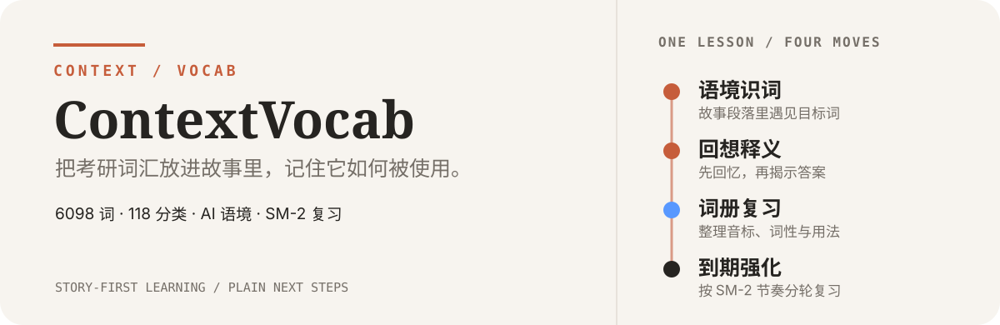
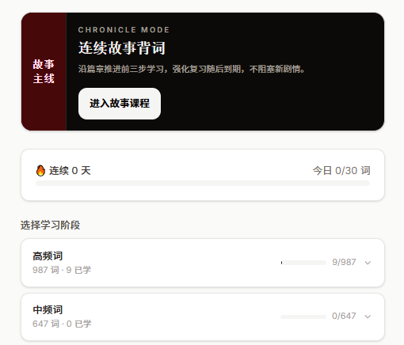
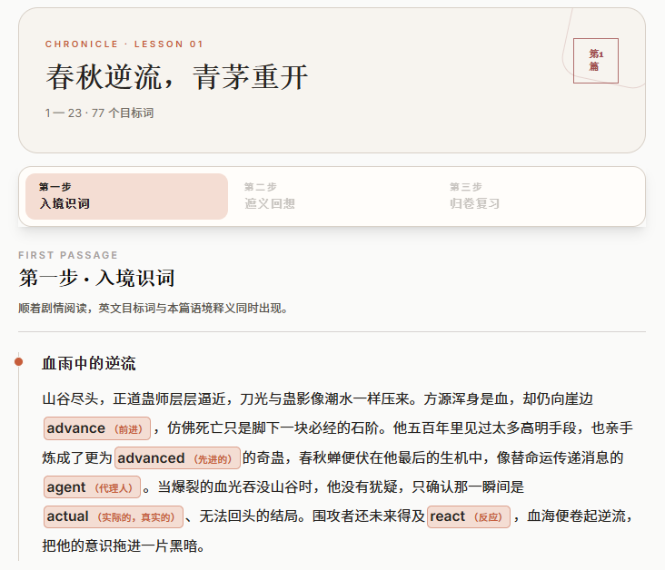
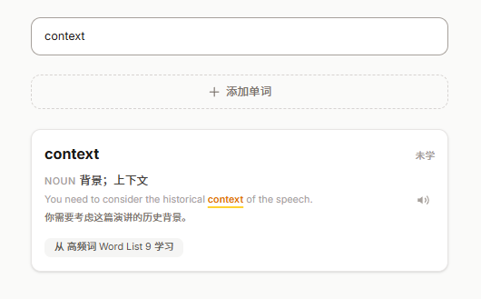
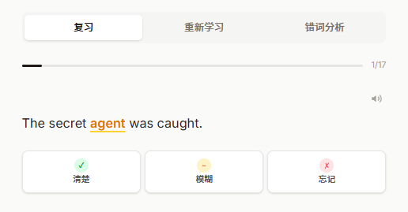
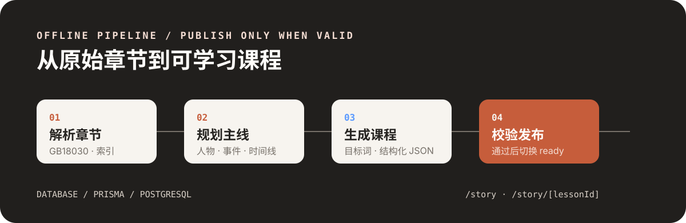
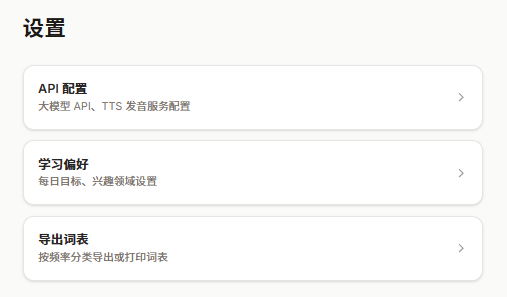

# ContextVocab

<p align="center">
  
</p>

<p align="center">
  <strong>为考研英语学习设计的语境词汇工作台。</strong><br>
  用连续故事、AI 释义与 SM-2 间隔复习，把单词从词表带进可理解、可回想的语境。
</p>

<p align="center">
  <a href="https://github.com/HP-Patience/English_Context/stargazers"></a>
  <a href="https://github.com/HP-Patience/English_Context/network/members"></a>
  <a href="https://github.com/HP-Patience/English_Context/graphs/contributors"></a>
  <a href="https://github.com/HP-Patience/English_Context/issues"></a>
  <a href="https://github.com/HP-Patience/English_Context/commits/master"></a>
  <a href="https://nodejs.org/"></a>
  <a href="https://nextjs.org/"></a>
  <a href="https://www.postgresql.org/"></a>
</p>


## 项目概览

首页把故事课程、分类词库和今日复习放在同一个入口。学习者可以沿连续剧情推进，也可以按考研词频分组学习，随时回到到期复习。

<p align="center">
  
</p>


ContextVocab 用三层内容解决孤立词卡中“认识这个词”和“会在语境中理解这个词”的脱节：

- **考研词库**：6098 个词，按 118 个分组组织，支持高频、中频、低频、偶考、基础和补充分类。
- **语境内容**：AI 为词义生成例句；故事模式将目标词嵌入连续的中文剧情改写中。
- **记忆调度**：每次自评都会更新词义级 SM-2 参数、掌握度和下一次复习时间。

## 学习方式

### 连续故事学习

故事模式沿连续篇章推进，在中文叙事中嵌入英文目标词。一篇课不是互不相关的句子集合，而是一条可继续推进的学习链。

<p align="center">
  
</p>

1. **语境识词**：在故事段落中遇见目标词，并看到本篇语境释义。
2. **回想释义**：先隐藏答案，让自己从上下文回忆词义。
3. **词册复习**：集中查看音标、词性、释义和故事用法。
4. **到期强化**：只处理当前到期的词，结果同步现有 SM-2 调度。

### 搜索与词条

搜索可以直接定位单词，词条卡同时呈现词性、中文释义、英文例句、翻译和所属词表，让查询结果可以立即回到学习流程。

<p align="center">
  
</p>

### 间隔复习

复习时先阅读英文语境，再选择“清楚 / 模糊 / 忘记”。结果会更新词义级掌握度与下一次复习时间，同一释义可以轮换不同例句。

<p align="center">
  
</p>
## 故事课程如何生成

<p align="center">
  
</p>

故事内容在离线阶段生成，原始小说放在 `data/local/story/`，用户请求只读取数据库中的已发布课程，不在浏览器端读取小说，也不在学习过程中调用 LLM。发布前会检查词覆盖、课程数量、章节顺序、前后衔接和 JSON 结构。

## 快速开始

### 环境

- Node.js `20.9+`
- PostgreSQL `16+`
- 一个可用的 LLM API key，用于生成释义、例句或离线故事内容

### 本地运行

```bash
npm install
cp .env.example .env
# 编辑 .env，填写 OPENAI_API_KEY 和本地 DATABASE_URL

psql -U postgres -c "CREATE DATABASE english_context;"
npx prisma db push
npm run dev
```

打开 <http://localhost:3456>。

初始化词库和 AI 内容：

```bash
node scripts/import-new.js
node scripts/generate-meanings.js
```

### 个性化配置

应用内可以分别配置 LLM API、学习偏好和词表导出，不需要把这些操作混进学习页面。

<p align="center">
  
</p>

## 故事模式

准备好普通词库后，按顺序执行离线流水线：

```bash
npm run story:parse
npm run story:outline
npm run story:generate
npm run story:validate
```

通过完整校验后，draft course 才会进入唯一的 `ready` 槽位；旧版本会归档，已发布版本保持不可变。运行 `/story` 查看课程列表，运行 `/story/[lessonId]` 进入单篇学习。

> `story:outline` 会把原始章节正文发送到配置的 LLM endpoint。运行前请确认该 endpoint 的数据保留政策、版权授权、隐私要求和组织合规条件。

## 数据与边界

- 原始小说只用于本地生成，不进入 `public/`、Git 或浏览器响应。
- 运行时只读取已发布的结构化 paragraph、目标词和用户进度。
- 故事 Step4 不阻塞下一篇；每个词的五轮强化按到期时间独立推进。
- 普通 `/learn` 与 `/review` 保持可用，并与故事模式共享 `Word`、`Meaning`、`UserWord` 和 `UserWordMeaning` 数据。

<details>
<summary>展开：生成约束与常用夹具命令</summary>

生产约束是精确 6098 个词、61–150 篇课程、每篇最多 100 个目标词。生成器支持批次、失败重试、断点续跑和输入指纹校验。

使用小型本地夹具时，可以覆盖输入文件和词数：

```bash
node scripts/parse-novel.mjs \
  --source path/to/fixture.txt \
  --output path/to/cache/novel-index.json

node scripts/build-story-outline.mjs \
  --source path/to/fixture.txt \
  --index path/to/cache/novel-index.json \
  --output path/to/cache/story-outline.json \
  --vocabulary-count 205

node scripts/generate-story-lessons.mjs \
  --index path/to/cache/novel-index.json \
  --outline path/to/cache/story-outline.json \
  --checkpoint-dir path/to/cache/lessons \
  --report path/to/cache/story-generation-report.json \
  --expected-word-count 205
```

</details>

## 验证

```bash
# route/service/persistence smoke，不连接真实数据库
npm run test:runtime -- scripts/test/story-runtime-smoke.mjs

# 全部 runtime/Vitest
npm run test:runtime

# 故事流水线测试
npm run test:story

# 类型检查与生产构建
npx tsc --noEmit
npm run build
```

当前仓库全量 lint 有既有债务；运行 `npm run lint` 时应记录基线并确认没有新增问题。离线发布和部署前，仍应在一次性 PostgreSQL 环境执行校验与浏览器验收。

## 项目结构

```text
src/app/
  page.tsx              首页与学习入口
  learn/                普通词卡学习
  review/               SM-2 间隔复习
  story/                连续故事课程与四步学习
  settings/             兴趣设置与 LLM 配置
  api/                  API 路由
prisma/schema.prisma    数据模型
scripts/                词库、AI 内容与故事流水线
data/                   本地词库输入
```

## License

本项目的代码与生成内容请以仓库实际许可文件为准。原始小说不属于项目运行时资产，不应提交或部署。
